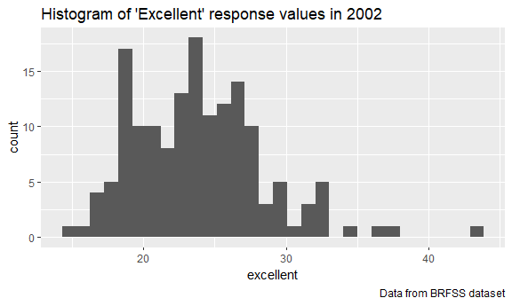
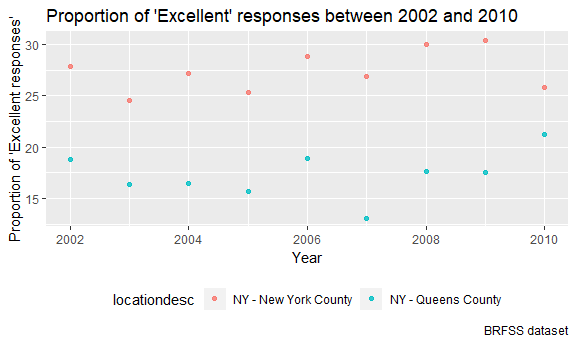

P8105 Homework 2
================

Problem 1 - NYC Transit Dataset
-------------------------------

    # Read and clean NYC Transit dataset
    transit_df <- read_csv("./data/NYC_Transit_Subway_Entrance_And_Exit_Data.csv") %>% 
      janitor::clean_names() %>% 
      select(line:entry, vending, ada) %>% 
      mutate(entry = recode(entry, "YES" = TRUE, "NO" = FALSE))

    transit_df

    ## # A tibble: 1,868 x 19
    ##    line  station_name station_latitude station_longitu~ route1 route2
    ##    <chr> <chr>                   <dbl>            <dbl> <chr>  <chr> 
    ##  1 4 Av~ 25th St                  40.7            -74.0 R      <NA>  
    ##  2 4 Av~ 25th St                  40.7            -74.0 R      <NA>  
    ##  3 4 Av~ 36th St                  40.7            -74.0 N      R     
    ##  4 4 Av~ 36th St                  40.7            -74.0 N      R     
    ##  5 4 Av~ 36th St                  40.7            -74.0 N      R     
    ##  6 4 Av~ 45th St                  40.6            -74.0 R      <NA>  
    ##  7 4 Av~ 45th St                  40.6            -74.0 R      <NA>  
    ##  8 4 Av~ 45th St                  40.6            -74.0 R      <NA>  
    ##  9 4 Av~ 45th St                  40.6            -74.0 R      <NA>  
    ## 10 4 Av~ 53rd St                  40.6            -74.0 R      <NA>  
    ## # ... with 1,858 more rows, and 13 more variables: route3 <chr>,
    ## #   route4 <chr>, route5 <chr>, route6 <chr>, route7 <chr>, route8 <int>,
    ## #   route9 <int>, route10 <int>, route11 <int>, entrance_type <chr>,
    ## #   entry <lgl>, vending <chr>, ada <lgl>

The NYC Transit dataset includes information on the exits and entrances
of various subway stations in the NYC transit network. The variables
used to describe this information include railway lines, station names,
locations, routes served, entries, entrance types, vending machines, and
ADA compliance. Thus far, the data cleaning steps include cleaning the
variable names, selecting relevant variables to keep in the dataset, and
recoding the *entry* variable into a logical type (TRUE vs. FALSE). The
dimension of this dataset is 1868 observations with 19 variables.

Tidiness depends on what information you are looking to get out of the
dataset. The part of the NYC transit dataset I would consider untidy are
the route numbers. The variable names of route numbers should instead be
used as values, especially if you are are looking to compare individual
subway stations.

-   There are 465 distinct stations.  
-   There are 468 stations that are ADA compliant.  
-   The proportion of station entrances/exits without vending that allow
    entry is 0.3770492

<!-- -->

    # Tidy up route variables using gather
    transit_tidy_df = 
     gather(transit_df, key = route_number, value = route_name, route1:route11)

    transit_tidy_df

    ## # A tibble: 20,548 x 10
    ##    line  station_name station_latitude station_longitu~ entrance_type entry
    ##    <chr> <chr>                   <dbl>            <dbl> <chr>         <lgl>
    ##  1 4 Av~ 25th St                  40.7            -74.0 Stair         TRUE 
    ##  2 4 Av~ 25th St                  40.7            -74.0 Stair         TRUE 
    ##  3 4 Av~ 36th St                  40.7            -74.0 Stair         TRUE 
    ##  4 4 Av~ 36th St                  40.7            -74.0 Stair         TRUE 
    ##  5 4 Av~ 36th St                  40.7            -74.0 Stair         TRUE 
    ##  6 4 Av~ 45th St                  40.6            -74.0 Stair         TRUE 
    ##  7 4 Av~ 45th St                  40.6            -74.0 Stair         TRUE 
    ##  8 4 Av~ 45th St                  40.6            -74.0 Stair         TRUE 
    ##  9 4 Av~ 45th St                  40.6            -74.0 Stair         TRUE 
    ## 10 4 Av~ 53rd St                  40.6            -74.0 Stair         TRUE 
    ## # ... with 20,538 more rows, and 4 more variables: vending <chr>,
    ## #   ada <lgl>, route_number <chr>, route_name <chr>

-   There are 60 distinct stations that serve the A train.
-   Of the stations that serve the A train, 17 are ADA compliant.

Problem 2
---------

### Mr. Trashwheel Dataset

    # Load and clean Mr. Trash Wheel dataset
    mr_trash_df = readxl::read_excel("./data/HealthyHarborWaterWheelTotals2018-7-28.xlsx", range = cellranger::cell_cols("A:N")) %>% 
      janitor::clean_names() %>% 
      filter(!is.na(date)) %>% 
      mutate(sports_balls = as.integer(round(sports_balls)))

    mr_trash_df

    ## # A tibble: 285 x 14
    ##    dumpster month  year date                weight_tons volume_cubic_ya~
    ##       <dbl> <chr> <dbl> <dttm>                    <dbl>            <dbl>
    ##  1        1 May    2014 2014-05-16 00:00:00        4.31               18
    ##  2        2 May    2014 2014-05-16 00:00:00        2.74               13
    ##  3        3 May    2014 2014-05-16 00:00:00        3.45               15
    ##  4        4 May    2014 2014-05-17 00:00:00        3.1                15
    ##  5        5 May    2014 2014-05-17 00:00:00        4.06               18
    ##  6        6 May    2014 2014-05-20 00:00:00        2.71               13
    ##  7        7 May    2014 2014-05-21 00:00:00        1.91                8
    ##  8        8 May    2014 2014-05-28 00:00:00        3.7                16
    ##  9        9 June   2014 2014-06-05 00:00:00        2.52               14
    ## 10       10 June   2014 2014-06-11 00:00:00        3.76               18
    ## # ... with 275 more rows, and 8 more variables: plastic_bottles <dbl>,
    ## #   polystyrene <dbl>, cigarette_butts <dbl>, glass_bottles <dbl>,
    ## #   grocery_bags <dbl>, chip_bags <dbl>, sports_balls <int>,
    ## #   homes_powered <dbl>

In the Mr. Trash Wheel dataset, there are 285 observations and 14
variables. The median number of sports balls collected by the dumpster
in 2016 is 26. Since 2014, the Mr. Trash Wheel has collected 4439 which
is about 186.988tons per year.

### Precipitation Dataset

    # Load and clean Precipitation 2017 Dataset
    prcp_2017_df = readxl::read_excel("./data/HealthyHarborWaterWheelTotals2018-7-28.xlsx", sheet = "2017 Precipitation", skip = 1) %>% 
      janitor::clean_names() %>% 
      filter(!is.na(month)) %>% 
      mutate(total_prcp = total, year = 2017) %>% 
      select(month, total_prcp, year)

    # Load and clean Precipitation 2016 Dataset
    prcp_2016_df = readxl::read_excel("./data/HealthyHarborWaterWheelTotals2018-7-28.xlsx", sheet = "2016 Precipitation", skip = 1) %>% 
      janitor::clean_names() %>% 
      filter(!is.na(month)) %>% 
      mutate(total_prcp = total, year = 2016) %>% 
      select(month, total_prcp, year)

    # Combine 2016 and 2017 precipitation datasets
    prcp_tidy_df = bind_rows(prcp_2016_df, prcp_2017_df) %>% 
      mutate(month = month.name[month])

    prcp_tidy_df

    ## # A tibble: 24 x 3
    ##    month     total_prcp  year
    ##    <chr>          <dbl> <dbl>
    ##  1 January         3.23  2016
    ##  2 February        5.32  2016
    ##  3 March           2.24  2016
    ##  4 April           1.78  2016
    ##  5 May             5.19  2016
    ##  6 June            3.2   2016
    ##  7 July            6.09  2016
    ##  8 August          3.96  2016
    ##  9 September       4.53  2016
    ## 10 October         0.62  2016
    ## # ... with 14 more rows

In the joined 2016 and 2017 precipitation dataset, there are 24
observations and 3 variables which include month, total precipitation,
and year. The total precipitation in 2017 was 32.93 inches.

Problem 3 - BRFSS Dataset
-------------------------

    # Load and clean BRFSS dataset
    brfss_df = brfss_smart2010 %>% 
      janitor::clean_names() %>% 
      filter(topic == "Overall Health") %>% 
      select(year:locationdesc, response, data_value) %>% 
      spread(key = response, value = data_value) %>% 
      janitor::clean_names() %>% 
      mutate(excellent_very_good = excellent + very_good)

    brfss_df

    ## # A tibble: 2,125 x 9
    ##     year locationabbr locationdesc excellent  fair  good  poor very_good
    ##    <int> <chr>        <chr>            <dbl> <dbl> <dbl> <dbl>     <dbl>
    ##  1  2002 AK           AK - Anchor~      27.9   8.6  23.8   5.9      33.7
    ##  2  2002 AL           AL - Jeffer~      18.5  12.1  32.7   5.9      30.9
    ##  3  2002 AR           AR - Pulask~      24.1  12.5  29.9   4.2      29.3
    ##  4  2002 AZ           AZ - Marico~      21.6  10.3  26.9   4.6      36.6
    ##  5  2002 AZ           AZ - Pima C~      26.6   7.5  31.9   3.9      30.1
    ##  6  2002 CA           CA - Los An~      22.7  14.3  28.7   4.5      29.8
    ##  7  2002 CO           CO - Adams ~      21.2  14.4  29     4.2      31.2
    ##  8  2002 CO           CO - Arapah~      25.5   8    29.3   2.1      35.2
    ##  9  2002 CO           CO - Denver~      22.2  11.1  36.6   3        27.1
    ## 10  2002 CO           CO - Jeffer~      23.4  11.4  26.3   2.4      36.6
    ## # ... with 2,115 more rows, and 1 more variable: excellent_very_good <dbl>

The BRFSS dataset contains information on how individuals in the United
States rated their overall health on a scale of poor to excellent. This
dataset has 2125 observations and 9. Surveys were taken in 404 distinct
locations within the United States. Of these locations, 51 states
including Washington D.C. were included. In 2002, the median of the
"Excellent" response value was 23.6%.

    # Histogram of "Excellent" response values in 2002
    ggplot(filter(brfss_df, year == 2002), aes(x = excellent)) + 
      geom_histogram() +
      labs(
        title = "Histogram of 'Excellent' response values in 2002", 
        caption = "Data from BRFSS dataset"
      ) 

    ## `stat_bin()` using `bins = 30`. Pick better value with `binwidth`.

    ## Warning: Removed 2 rows containing non-finite values (stat_bin).

    # Save histogram as pdf
    ggsave("hist_hw2.pdf")

    ## Saving 6 x 3.59 in image
    ## `stat_bin()` using `bins = 30`. Pick better value with `binwidth`.

    ## Warning: Removed 2 rows containing non-finite values (stat_bin).

    # Scatterplot of "Excellent" response values in New York County and Queens County from 2002 to 2010
    ggplot(filter(brfss_df, locationdesc == "NY - New York County" | locationdesc == "NY - Queens County"), aes(x = year, y = excellent)) + 
      geom_point(aes(color = locationdesc), alpha = .8) + 
      labs(
        title = "Proportion of 'Excellent' responses in New York and Queens Country between 2002 and 2010",
        x = "Year", 
        y = "Proportion of 'Excellent responses'",
        caption = "BRFSS dataset"
      ) + 
      theme(legend.position = "bottom")

    # Save scatterplot as pdf
    ggsave("scatterplot_hw2.pdf")

    ## Saving 6 x 3.59 in image
